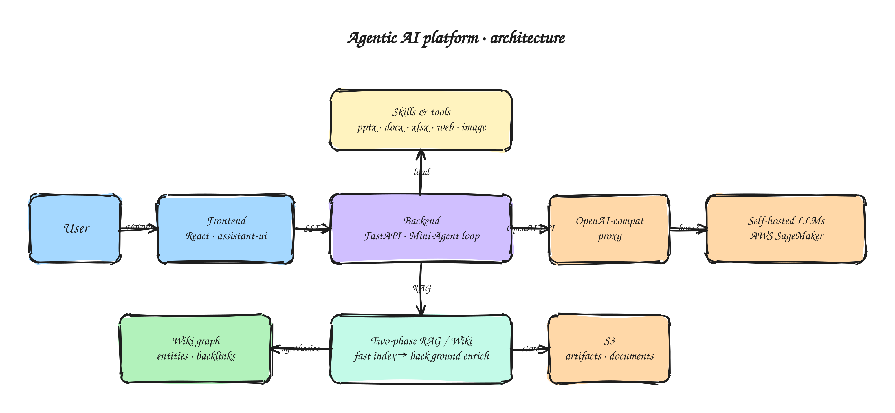

# Agentic AI platform

Internal LLM agent product I shipped for a small team. The codebase is private; this is the public-facing version of how it's put together and what I learned.

## What it is

Two-panel chat. Conversation on the left, artifact viewer on the right (PPTX, DOCX, XLSX, code, charts). The agent can search the web, fetch URLs, ingest documents, generate artifacts that pop into the side panel, and push its own outputs back into a wiki it then reads from on later turns.

The agent loop is a fork of [MiniMax Mini-Agent](https://github.com/MiniMax-AI/MiniMax-Agent). I wrote everything around it.

## Wrapping the harness

Open-source agent loops are designed to run from a CLI. Putting one inside a chat product was most of the work, and most of it wasn't interesting.

The harness emits its own event stream: tokens, tool-call starts and ends, tool outputs, errors. The frontend wants typed SSE frames. I wrote an adapter that subscribes to the harness bus and re-emits frames in the shape `assistant-ui` consumes. About a dozen event types mapped, plus reconnect handling for when the user's network blips.

Sessions were the next problem. Mini-Agent thinks in one session per process. Users open a thread, close the tab, come back the next day, and expect their messages to still be there. The harness has no rehydration story, so I had to snapshot the relevant state and restore it on resume.

Each tool call needed its own UI. A search renders the URL, image gen renders the prompt while it runs, a long bash command collapses into an expandable header. I built a `ToolCallUI` that dispatches to a registered renderer per tool. Without that, every new tool would have been a frontend PR.

Long outputs (a 12-slide deck, a 600-line file, a chart) don't fit in a chat bubble. They go to a separate artifact bus and render in the side panel. The user keeps scrolling chat while the latest doc loads beside it.

## Skills

A "skill" is a `SKILL.md` file with reference docs and helper scripts. The agent loads it on demand and chains tool calls through it. I wrote skills for deck/doc/spreadsheet generation, document parsing, image generation, and deployment automation. A few things I had to learn the hard way:

Models copy fenced code blocks from `SKILL.md` literally. Put a `tool_call(...)` example in a triple-backtick block as documentation and the model will emit that fenced block as text in its reply instead of actually invoking the tool. Cost me half a day on a skill that "almost worked, but never actually called the tool". Fix: never use code blocks to demonstrate tool usage. Use imperative markdown sentences.

Skills have to load lazily. Pre-loading every skill at session start blew up the context budget and made the model worse at deciding when to use any of them. Skills now load only when the model asks for them by name.

Silent skill failures are the worst class of bug. If a skill no-ops, the model thinks the work is done and confidently tells the user "I've created your deck." Every skill now has to raise an error string the agent has to surface.

Rules files beat narrative. Behavioural guidance lives in `.claude/rules/*.md`, one rule per file, terse. Long narrative SKILL files don't steer the model nearly as well. Models scan rule files; they skim paragraphs.

## OpenAI → SageMaker proxy

The harness expects OpenAI-compatible endpoints. My models live on SageMaker, which uses a different request shape and IAM-based auth. So there's a thin FastAPI proxy in front: it translates `chat/completions` and `embeddings`, handles streaming both ways, routes by model id, and normalises errors. About 200 lines. Lets every consumer pretend SageMaker doesn't exist.

## Two-phase RAG

Naive RAG ingestion is chunk-embed-store-retrieve. Fine on small documents. Upload a 200-page PDF and the user watches a spinner for three minutes before they can ask anything.

I split it.

**Phase 1** is fast and blocking. Parse, chunk, embed, write to the vector store. Done in around thirty seconds for typical inputs. The user can query immediately.

**Phase 2** is slow and runs in the background. A separate agent re-reads the document, extracts entities and concepts, builds wiki pages with crosslinks and backlinks, and slots entities into a knowledge graph. Takes minutes. The user has long since gone back to chatting.

Retrieval pulls back Phase 1 chunks plus Phase 2 wiki entries that reference them. Phase 2 is also toggle-able by environment, useful for keeping inference cost down outside of production.

The bit that ended up mattering most was a "save to wiki" button on the agent's outputs. Saving runs the same two-phase pipeline on the agent's own message, so prior synthesis becomes corpus on later turns. Over a few weeks of use, the wiki turns into a third source that retrieves a lot better than the raw documents do, because the language already matches what the model produces.

A live timeline in the UI shows phase 1 done, phase 2 running, entities extracted, wiki page written. Beats a spinner that won't tell you why it's taking so long.

## Frontend

`assistant-ui` for the message-list primitive. On top of that: custom content parts for tool calls, artifacts, file refs, and errors. Inline mermaid rendering with a pre-render validation step, because malformed diagrams used to crash the whole message instead of failing inline. Resizable two-panel layout. Long tool calls default to a one-line collapsed header so a chat with twenty calls is still scannable.

## Stack

FastAPI on Python 3.11, supervisord in production. React 18 + TypeScript + Tailwind + Vite on the frontend with `assistant-ui` as the chat primitive. Forked Mini-Agent for the agent loop. Self-hosted LLMs on SageMaker for chat, embeddings, and rerankers. Postgres for memory, S3 for documents and artifacts. Docker Compose in dev, supervisord on EC2 in prod.

## What I'd do differently

Committed to a vendor harness too early. I spent weeks forcing it into product shapes it wasn't designed for. Building the streaming and tool-call surface first against the thinnest possible in-house loop, getting the contracts stable, then swapping in a real harness — that would have saved a lot of pain.

Treated skills as throwaway prompts at the start. They turned out to be the highest-leverage thing in the system. Versioning, tests, and CI all had to be retrofitted, and the retrofit was a mess. Should have been there from day one.

No structured logging in the skill protocol. The cheapest debugging signal when a skill misbehaves is an event log of entries, exits, tool calls, and outputs. Adding that after the fact was a slog and is still incomplete.

## Why no source

The codebase belongs to the team I built it for. This is the public-facing version of the patterns and the lessons.
